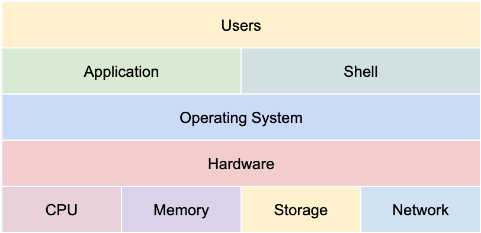
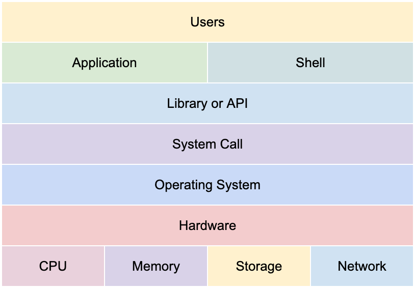

# OS

1. 사용자, 응용 프로그램, 운영체제, 컴퓨터 하드웨어와의 관계

   

2. 안드로이드는 OS일까?

   아니다. 안드로이드는 리눅스 커널을 사용한다. 커널은 OS의 핵심 기능이 들어가있는 공간인데 안드로이드의 경우 리눅스 커널을 그대로 사용하기 때문에 독립적인 OS라고 볼 수 없고 리눅스 커널 위에 일종의 프레임워크가 올려진 시스템이라고 볼 수 있다.

3. MacOS는 리눅스 기반 OS인가?

   아니다. MacOS는 태생부터 달랐다. MacOS 커널은 마이크로 커널(Mach)의 기능과 단일 칩 커널(BSD)을 결합하지만 리눅스는 단일 칩 커널이다. MacOS 커널(XNU)은 리눅스보다 오래 사용되었고 더 오래된 두 개의 코드를 기반으로 한다. 리눅스는 처음부터 새로 작성되어 더 많은 장치에 사용된다.

4. Shell

   쉘은 커널 위에 존재하는데 커널(알맹이)을 싸고 있는(쉘) 형태라고 생각하면 쉽다. 그래서 쉘은 사용자가 운영 체제 기능과 서비스를 조작할 수 있도록 인터페이스를 제공하는 프로그램이다. 쉘은 터미널 환경(CLI: command line interface)과 GUI(grapical user interface) 환경으로 구분된다.

5. 시스템 콜

   어플리케이션이 어떤 동작을 하고자 할 때 운영체제에 동작을 요청하고, 운영체제가 그것을 확인해 실제 하드웨어에 동작을 전달하는 과정이 있다. 이 과정에서 운영체제가 운영체제의 각 기능을 사용할 수 있도록 하는 명령 또는 함수를 시스템 콜이라고 한다. 시스템 콜을 개발자가 직접 보는 경우는 거의 없고 어떤 명령을 실행했을 때 해당 언어의 라이브러리가 있고, 그 라이브러리가 시스템 콜을 호출하고, 시스템 콜이 운영체제에 동작을 전달하는 방식으로 동작한다.

   운영체제는 운영체제의 기능을 외부에서 조작하는 것이 아니라 스스로 동작하게 해야 한다. 이렇게 사용할 수 있도록 하는 것이 시스템 콜이다.

6. 포팅

   운영체제를 만들 경우 시스템 콜을 먼저 만든다. 이후 어떤 언어에든 동작할 수 있도록 대응해야 하기 때문에 각 언어별로 시스템 콜을 호출할 수 있도록 맞춰줘야 한다. 이것을 포팅이라고 한다.

7. 운영체제 동작 방식

   

   Application 혹은 Shell이 라이브러리 혹은 API를 실행하면 라이브러리 혹은 API가 시스템 콜을 호출하고, 포팅된 시스템 콜은 명령을 운영체제에 전달한다. 그 과정을 통해 운영체제는 하드웨어를 조작해 특정 동작을 실행한다.

8. 운영체제를 만든다면?

   1. 운영체제를 개발한다 (kernel)
   2. 시스템 콜을 개발
   3. 시스템 콜 기반 프로그래밍 언어별 라이브러리 개발 (API)
   4. 지원되는 프로그래밍 언어로 Shell 프로그램 개발
   5. 지원되는 프로그래밍 언어로 응용 프로그램 개발

---

정리

* 운영체제는 시스템 콜을 제공한다.
* 프로그래밍 언어별 운영체제 지원을 위해 운영체제별 API를 제공한다.
* 응용프로그램 개발시 운영체제 기능이 필요한 경우 해당 API를 사용해 프로그램을 작성한다.
* 응용프로그램 실행시 해당 API를 호출하면 시스템 콜을 호출함과 동시에 사용자 모드를 커널 모드로 변경한다. 이후 운영체제 내부에서 해당 명령이 실행되고 으용프로그램에 결과를 리턴한다.